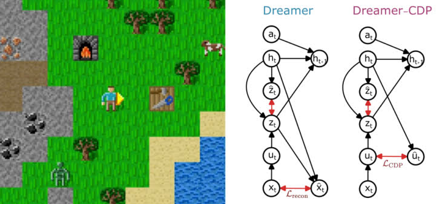
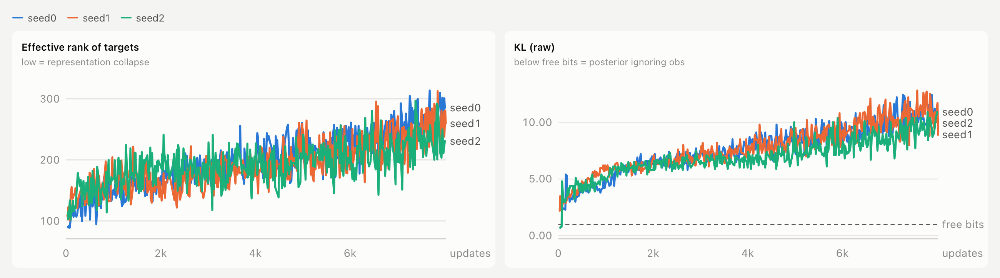
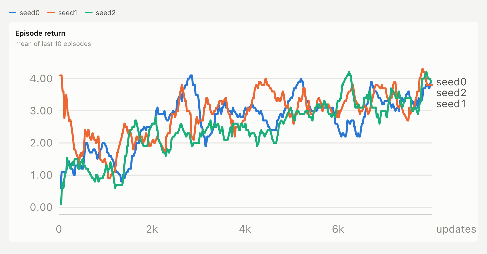
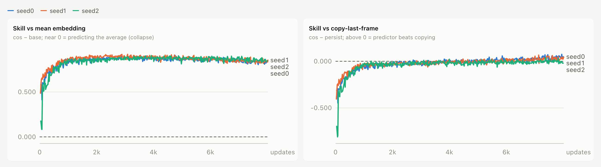

# Dreamer-CDP on Crafter

A reconstruction-free DreamerV3: the image decoder is removed, and the world
model instead learns by **predicting the next frame's embedding** from the
recurrent state (Dreamer-CDP, [arXiv 2603.07083](https://arxiv.org/abs/2603.07083)).
Written from scratch in PyTorch and trained online on
[Crafter](https://github.com/danijar/crafter) (collect -> train world model ->
train actor-critic in imagination -> collect).



*Left: Crafter. Right: Dreamer reconstructs the frame x_t from the latent
(L_recon); Dreamer-CDP drops the decoder and instead predicts the frame's
embedding u_t from the recurrent state h_t (L_CDP). Figure from
[arXiv 2603.07083](https://arxiv.org/abs/2603.07083).*

The interesting part is not the architecture but **why it collapses on
Crafter and what fixes it** - see [The collapse](#the-collapse) below.

## What is from the paper and what is not

| | |
|---|---|
| **From Dreamer-CDP** | no decoder; predictor `h_t -> y_t` (next-frame embedding); negative cosine loss scaled by `beta_cdp = 500`; stop-gradient on the target |
| **From DreamerV3** | RSSM with 32x32 discrete latents + straight-through gradients, 1% unimix, KL balancing (dyn 0.5 / rep 0.1) with free bits 1.0, symlog two-hot reward and critic, percentile return normalisation, REINFORCE actor for discrete actions, LayerNorm + SiLU MLPs, LayerNorm GRU with update bias -1, zero-initialised reward / critic outputs, lambda-returns from the live critic with an EMA-critic regulariser |
| **Added here** | **centered CDP loss** (target and prediction centered by the batch-mean target, DINO-style), **EMA target encoder** (`enc_tau = 0.999`), a copy-last-frame baseline and effective-rank / KL / encoder-drift monitoring |

## Setup

Conda env `dreamer`, Python 3.11: `torch 2.13`, `crafter 1.8.3`,
`numpy 1.26.4`, `gym 0.25.2`, `tqdm`.

**Do not upgrade gym or numpy.** Crafter and `train.py` use the old 4-tuple
`step()` API that gym 0.26 rejects, and gym 0.25 breaks on numpy 2.

```bash
conda create -n dreamer python=3.11
conda activate dreamer
pip install torch crafter==1.8.3 numpy==1.26.4 gym==0.25.2 tqdm
```

Runs on Apple `mps` if available, otherwise CPU.

## Layout

```
config.py           every hyperparameter (one dataclass)
encoder.py          4-layer CNN, 64x64x3 -> 6144-d embedding
rssm.py             input projection + GRU + prior / posterior (32x32 categorical)
GRU.py              LayerNorm GRU
heads.py            reward head, continue head, CDP predictor
world_model.py      observe(), centered CDP loss, KL, reward / continue losses
                    + self-test (gradient routing, time alignment, sizes)
actor.py            categorical policy over 17 Crafter actions
critic.py           two-hot critic + EMA target update
imagine.py          imagined rollouts, lambda-returns, percentile scale
losses.py           actor / critic losses + self-test
replay_buffer.py    episode buffer, sequence sampling
train.py            online training loop
random_baseline.py  random-policy return and Crafter score
utils/
  mlp.py            Linear -> LayerNorm -> SiLU blocks
  distributions.py  unimix, straight-through sampling
  symlog.py         symlog / symexp, two-hot encoding
  crafter_eval.py   Crafter score (geometric mean of achievement rates)
run_seeds.sh        seeds 0 1 2 back to back, then a summary
summarize_seeds.py  mean +- std across seeds from results.json
watch_runs.py       live status + collapse warnings
viz_runs.py         HTML dashboard of all training curves
```

## Run it

```bash
python world_model.py       # self-test: finite losses, gradient routing, h_t never sees frame t
python losses.py            # self-test: actor / critic gradients go where they should

./run_seeds.sh              # 3 seeds x 50k env steps -> checkpoint_v3arch_seed{0,1,2}/
./run_seeds.sh 3 4          # other seeds
STEPS=10000 ./run_seeds.sh  # shorter runs
```

A single run is `SEED=0 RUN_DIR=checkpoint_test STEPS=50000 python train.py`.
Each run directory gets `train.log`, `wm.pth`, `actor.pth`, `critic.pth` and
`results.json` (every episode return, first / last fifth, best, Crafter score,
achievement rates). Checkpoints are saved every 500 updates.

Training ratio is 128 replayed steps per env step (batch 16 x length 50), so
50k env steps is ~8,000 updates, about 3 h on an M-series GPU.

```bash
python random_baseline.py                          # reference: random policy
python summarize_seeds.py checkpoint_v3arch_seed*  # table + mean +- std
```

## Watching a run

```bash
python watch_runs.py        # status of every seed, once
python watch_runs.py -f     # refresh every 30 s
python viz_runs.py -f       # HTML dashboard, regenerated every 60 s
```

Both only read `train.log`, so they never touch the training process.

## Reading the training log

One line every 10 updates. The columns that matter:

| column | meaning | healthy | broken |
|---|---|---|---|
| `cos` | cosine(predicted, target), centered | rises, plateaus well above 0 | ~0 |
| `skill` | `cos - base`, gain over predicting the mean embedding | clearly > 0 | ~0: predictor outputs the average |
| `skill_p` | `cos - persist`, gain over copying the last frame | the real test, > 0 is the goal | see [Limitations](#limitations) |
| `erank` | effective rank of the target embeddings | ~100-250 | falls toward 1 |
| `klraw` | KL(posterior \|\| prior) before free bits | a few nats | < 1: the posterior has stopped reading the image |
| `drift` | relative encoder weight change from init | rises smoothly | frozen: the encoder is not learning |
| `gnorm` | world-model gradient norm (clip 1000) | tens to hundreds | sustained > 1000 |

`wm` is dominated by `500 x -cos`, so it goes strongly negative; `wm_nocdp` is
the rest of the world-model loss on its own.

## The collapse

Without a decoder nothing forces the latent to describe the image, and on
Crafter the naive CDP loss finds a shortcut.

| run | what happened |
|---|---|
| `enc_lr 6e-6`, 10k | no collapse, but the encoder barely moves (drift 0.013); predictor loses to copy-last-frame; score 1.80% vs random 1.46% |
| `enc_lr 1e-4` | collapse by update ~590 |
| + EMA target, `tau 0.99` | still collapses, by update 160 - EMA alone is not the fix |
| + EMA target, `tau 0.999` | targets stay healthy (erank ~135) but the **posterior ignores the image** by update 130 (klraw 0.3); predictor outputs the mean embedding |

**Root cause, measured on real Crafter frames:** the raw embeddings share so
much HUD and terrain content that *predicting the average embedding* already
scores a cosine of **0.97** with a random encoder and **0.82** with a trained
one. The cosine loss is ~97% satisfiable while ignoring the observation, and
any encoder learning rate fast enough to matter falls into that.

**Fix:** center both target and prediction by the batch-mean target before the
cosine (`world_model.py`, `compute_loss`). The mean embedding then scores 0, and
the only way to earn cosine is to predict what is specific to this frame. With
centering (`enc_lr 2e-5`, `tau 0.999`) no run has collapsed: klraw stays
above free bits and erank stays in the hundreds.



*Effective rank of the targets climbs from ~100 to ~250 and raw KL stays well
above free bits (dashed) for the whole run, in all three seeds.*

## Results

### Current backbone, 3 seeds x 50k env steps

| seed | episodes | first-fifth return | last-fifth return | best | Crafter score | `skill_p`, last 20% of updates |
|---|---|---|---|---|---|---|
| 0 | 288 | 1.42 | 3.40 | 6.10 | 2.40% | +0.028 |
| 1 | 279 | 1.94 | 3.39 | 6.10 | 2.83% | +0.024 |
| 2 | 299 | 1.32 | 3.34 | 7.10 | 2.46% | -0.006 |
| **mean +- std** | | **1.56 +- 0.33** | **3.38 +- 0.03** | **6.43 +- 0.58** | **2.57 +- 0.23%** | |

Random policy (300 episodes, same 500-step cap): return 1.31 +- 0.07 (standard error), Crafter score 1.46%.

Every seed ends at ~2.6x the random return, and the three final returns agree
to within 0.06. No run collapsed.



Achievement rates (% of episodes, seeds 0 / 1 / 2):

| achievement | 0 | 1 | 2 |
|---|---|---|---|
| wake_up | 95.1 | 90.3 | 92.3 |
| collect_sapling | 83.3 | 79.2 | 80.3 |
| place_plant | 81.2 | 70.6 | 75.9 |
| collect_wood | 40.3 | 55.9 | 44.8 |
| collect_drink | 44.1 | 48.0 | 21.4 |
| place_table | 3.8 | 20.1 | 11.0 |
| eat_cow | 6.9 | 6.1 | 8.7 |
| defeat_zombie | 6.9 | 2.5 | 5.4 |
| make_wood_pickaxe | - | 1.8 | 0.7 |
| defeat_skeleton | 0.3 | 0.7 | - |
| collect_stone | - | 0.4 | - |
| make_wood_sword | - | 0.4 | - |

**Predictor vs copy-last-frame.** With the earlier backbone `skill_p` never
went above 0. With the current one it crosses 0 in two of three seeds (seeds 0
and 1, positive on ~90% of logged updates in the last fifth of training) and
ends at ~0 in the third. The predictor now roughly matches copying the last
frame and beats it in most runs, but the margin is small.



*Left: gain over predicting the mean embedding, far from 0 in every seed, so
nothing collapsed to the average. Right: gain over copying the last frame,
crossing the dashed 0 line late in training.*

### Earlier backbone, single seed (for reference)

Before the DreamerV3-style layer changes (plain GRU, ReLU / ELU MLPs without
LayerNorm, target-critic returns). **Not directly comparable** to the table above.

| run | last-fifth return | best | Crafter score |
|---|---|---|---|
| uncentered, 50k | 2.51 | 5.10 | - |
| centered, 10k | - | - | 1.90% |
| centered, 50k | 2.71 | 5.10 | 2.09% |

Centered 50k achievement rates: wake_up 95%, collect_sapling 74%,
place_plant 70%, collect_wood 27%, collect_drink 16%, eat_cow 6%,
defeat_zombie 5%, place_table 2.1%, make_wood_sword 0.3%.

## Limitations

- **50k env steps, not 1M.** Crafter results are normally reported at 1M
  steps (DreamerV3 ~14-15%). These runs are 5% of that budget, so the absolute
  score says little; the point is stability and the comparison to random.
- **The margin over copy-last-frame is small** (`skill_p` about +0.03 in two
  seeds, about 0 in the third). Part of this is structural: the copy baseline
  uses the full 6144-d embedding of frame t-1, while the predictor only sees
  frame t-1 through the 1024-bit discrete state `s_{t-1}`. The DreamerV3-style
  backbone was enough to close most of that gap, not all of it.
- **Three seeds.** Enough to show the result is stable, not enough for tight
  error bars on the Crafter score.
- **No pixels from imagination.** There is no decoder, so dreams exist only as
  embeddings. Showing them needs a separate probe decoder trained on the frozen
  latents.
- Episodes are capped at 500 steps (Crafter's own limit is 10,000); the cap is
  not stored as a termination.

## Next

This repo is the baseline for a study of **mode-averaging in latent world
models**: a deterministic predictor trained with a regression loss converges to
the conditional mean, and at a stochastic branch point that mean is a latent
that corresponds to no reachable state. The question is whether that breaks
policy learning in imagination, and by how much.
